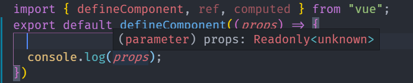

# vue3WithTypeScript
vue3+typescript项目实战

## 开源项目的开发发布流程

## 如何更合理的设计使用性的api

## 如何保证代码质量

## vue3的实现原理

## 核心功能

### 表单生成

### 主题系统

### 插件系统

---

# 项目结构
创建一个vue3项目并介绍其项目结构

升级或者安装vueCli

```sh
npm i -g @vue/cli
```

创建vue3项目

```sh
vue create vue3-json-schema-from-study
```

然后在 项目的配置文件 tsconfig.json中，有这么一段配置

```json
"jsx": "preserve",
```

这段配置的作用就是让ts不要去编译jsx代码，而是让babel去编译jsx。因为ts编译jsx是完全遵循react的一个编译规则，毕竟react不是vue，虽然他们最终呈现在jsx中的代码是一样的，但是他们编译出来的结果是会有区别的。所以需要在后续安装一个专门为vue3编译jsx的babel插件，这样才能最终让vue3能进行jsx开发

使用prettier_format，在项目中新建.prettierrc配置文件，添加一些简单配置

```json
{
    "semi": false,
    // 代码里面是否要写分号
    "singleQuote": true,
    // 是否使用单引号
    "arrowParens": "always",
    // 使用匿名函数的时候，参数是否一定要写括号
    "trailingComma": "all"
}
```

配置vs保存时自动根据prettier配置去格式化代码

```json
{
    "editor.formatOnSave": true
}
```

# Vue3开发模式讲解
介绍vue3的开发模式，着重介绍jsx的开发模式，这种开发模式相较于传统的vue2单文件template开发模式有很多优势。让大家在平时工作中多一种选择来维护项目

# Vue3的Ts定义
vue3源码全部都是使用的TypeScript编写，对于我们使用TypeScript来编写vue3应用的人来说，我们用好vue3的TypeScript定义就会大大的提高我们的开发效率

## Component接口

### defineComponent函数

如何定义Props的类型

defineComponent函数，只是对setup函数进行封装，返回options的对象；

```tsx
export function defineComponent(options: unknown) {
  return isFunction(options) ? { setup: options } : options
}
```

defineComponent最重要的是：在TypeScript下，给予了组件 **正确的参数类型推断** 

index.tsx


### defineComponent的4个重载函数

**1：direct setup function**

第一个重载，他直接接收一个函数作为参数，这个函数是一个setup的函数，然后我们只需要定义Props和RawBindings。需要注意的是，这种传递一个函数去定义组件的方式，这个props的声明我们任然是需要声明的。在这里声明的props只是一个纯Ts的定义，他不是一个真正的vue组件上的Props。而我们知道，vue的props是必须有一个对象的声明的。我们不能纯Ts的去声明，因为Vue对象上面如果没有挂props这个属性，就会导致他所有的props没有声明，使用的时候是会有问题的。所以这里不推荐直接这样使用，推荐的方式还是通过对象的方式去声明组件

```tsx
// overload 1: direct setup function
// (uses user defined props interface)
export function defineComponent<Props, RawBindings = object>(
  setup: (
    props: Readonly<Props>,
    ctx: SetupContext
  ) => RawBindings | RenderFunction
): DefineComponent<Props, RawBindings>
```



**2：object format with no props**

通过对象去声明组件，但是不传props。（这个没什么必要，跳过不谈）

```tsx
// overload 2: object format with no props
// (uses user defined props interface)
// return type is for Vetur and TSX support
export function defineComponent<
  Props = {},
  RawBindings = {},
  D = {},
  C extends ComputedOptions = {},
  M extends MethodOptions = {},
  Mixin extends ComponentOptionsMixin = ComponentOptionsMixin,
  Extends extends ComponentOptionsMixin = ComponentOptionsMixin,
  E extends EmitsOptions = EmitsOptions,
  EE extends string = string
>(
  options: ComponentOptionsWithoutProps<Props,RawBindings,D,C,M,Mixin,Extends,E,EE>
): DefineComponent<Props, RawBindings, D, C, M, Mixin, Extends, E, EE>
```


**3：object format with array props declaration**

通过对象去声明组件，并且通过array去声明props。

因为在vue2里是可以这样写props的，

```js
{
    props: ['name', 'age', 'xx']
}
```

通过这种方式去声明的组件，我们会发现所有的props都是 any类型的，所以其实这种也是不推荐的

```tsx
// overload 3: object format with array props declaration
// props inferred as { [key in PropNames]?: any }
// return type is for Vetur and TSX support
export function defineComponent<
  PropNames extends string,
  RawBindings,
  D,
  C extends ComputedOptions = {},
  M extends MethodOptions = {},
  Mixin extends ComponentOptionsMixin = ComponentOptionsMixin,
  Extends extends ComponentOptionsMixin = ComponentOptionsMixin,
  E extends EmitsOptions = Record<string, any>,
  EE extends string = string
>(
  options: ComponentOptionsWithArrayProps<
    PropNames,
    RawBindings,...>
): DefineComponent<
  Readonly<{ [key in PropNames]?: any }>,
  RawBindings,...>
```


**4: object format with object props declaration**

如果你要使用ts来写vue3，那么其实你是可以直接忽略前面3中写法，直接使用第四种写法，通过对象来声明props

```js
{
    props: {
        name: {
            type: string,
            required: true
        }
    }
}
```

只有这种写法才是最正统的，因为这种写法他会高数ts很多定义信息，包括他的类型，以及他是否是undefined

```tsx
// overload 4: object format with object props declaration
// see `ExtractPropTypes` in ./componentProps.ts
export function defineComponent<
  // the Readonly constraint allows TS to treat the type of { required: true }
  // as constant instead of boolean.
  PropsOptions extends Readonly<ComponentPropsOptions>,
  RawBindings,
  D,
  C extends ComputedOptions = {},
  M extends MethodOptions = {},
  Mixin extends ComponentOptionsMixin = ComponentOptionsMixin,
  Extends extends ComponentOptionsMixin = ComponentOptionsMixin,
  E extends EmitsOptions = Record<string, any>,
  EE extends string = string
>(
  options: ComponentOptionsWithObjectProps<
    PropsOptions, RawBindings, D, C, M, Mixin, Extends, E, EE>
): DefineComponent<PropsOptions, RawBindings, D, C, M, Mixin, Extends, E, EE>
```


**最终实现：**

上面4个都是函数定义，并没有真正的去实现，下面这个才是他的最终实现，做的事很简单，他会判断你传递进来的参数，如果他是一个函数，那么他会返回你一个包装过的对象，包装过的对象只有一个setup，就是我们传递进来的参数options，然后有一个name是options.name（这里就是声明了组件名字）；如果不是函数，是一个对象，那么他就直接返回这个对象。所以可以看见这个defineComponent很简单，他的就是用来声明和定义的，或者说，他就是给ts来直接用的。defineComponent对于想用ts写vue3应用的人来说十分重要。

总结来说，就是defineComponent会判断你传入的是不是一个方法，如果是一个方法，那么他会把你包裹成一个对象，也就是说我们带有状态的那个组件，他必须任然是一个对象，你不能去写成一个函数，因为vue会判断你传递进来的这个是不是一个函数，如果是一个函数，那么他就认为你是一个函数组件，是一个无状态的，你就不能使用像CompsitionAPI这些生成状态的代码。如果你传递进来的是一个对象，那么就直接返回这个对象。所以其实defineComponent其实就是返回你传入内容的一个函数，根本没有做任何其他的事情，但是他又非常重要，因为他告诉你了，或者说，帮你确定了你组件的一个定义

```javascript
export function defineComponent(option: unknown) {
    return isFunction(options)? {setup: options, name: options.name} : options;
}
```

### 开发实践

像data, computed这些之前的组件定义用法其实和vue2是一样的，需要特别注意的点是他这里props的写法

###### 一. TypeScript 定义复杂变量示例

对象、数组、函数等，都算复杂变量
复杂变量少用 any 定义数据类型，应该使用具体数据类型接口，定义数据类型
举个栗子：
类似 columnData: any[] = []，是不优雅的写法
类似 columnData: ColumnData[] = []，是优雅的写法
**举个栗子：**

```tsx
// bad
columnData: any[] = []
 
// good
interface ColumnData {
  title?: string;
  key?: number;
  type?: string;
  render?: object;
}
 
columnData: ColumnData[] = []
```

###### 二. 使用 PropType 定义 [vue](https://so.csdn.net/so/search?from=pc_blog_highlight&q=vue) props 数据类型示例

- 用 vue3 封装组件时，难免需要规定较为复杂的数据类型，用于声明组件接受的参数类型，比如下面这种数据类型接口

```tsx
  // 这是一个复杂的数据类型接口
  export interface ColumnProps {
    _id: number;
    title: string;
    description: string;
  }
```

假设我现在需要指定一个变量 list 的数据类型为 Array，如何规范 Array 的格式呢？

>错误示例：type: Array: ColumnProps[],
正确示例：type: Array as PropType<ColumnProps[]>,
原因：此处 Array 并非作为数据类型存在，而是作为 构造函数 存在，为构造函数指定类型，应用  PropType  这个 API

  **举个栗子：**

```tsx
// bad
  props: {
    list: {
      type: ColumnProps[],
      required: true
    }
  }
 
// good
import { PropType } from 'vue'
export interface ColumnProps {
  _id: string;
  title: string;
  description: string;
}
 
  props: {
    list: {
      // 此处的 Array 并不是变量类型，而是构造函数
      // 通过 PropType 指定构造函数的类型
      type: Array as PropType<ColumnProps[]>,
      required: true
    },
    sum: {
      // 这里我们要声明他为一个ts的类型，就需要指定数据类型
      // 这个PropType是我们从vue里面引入的一个PropType
      // 也就是说，我们要把它指定为Ts的类型，因为我们这里 props sum Number是纯js的语法，这里这个Number其实是一个类，他是单做一个变量在用的。并不是ts的一个定义，然后我们加上as之后，把它视为ts的类型Number
      type: Number as PropType<Number>,
      requried: true
    }
  }
```

如果对上面sum这个Number这个不是很理解，那这里再举一个例子，如果我们接受的是一个对象

```tsx
<script lang="ts">
    import {defineComponent, PropType} from 'vue'
    
    export default defineComponent({
        name: 'App',
        props: {
            config: {
                type: Object
            }
        }
    })
</script>
```

那这里Object为什么要写？因为对于js来说，我们传递的确实是一个对象，我们也不需要关心它有哪些key，它key的类型又是什么，但是对于ts我们是需要取关心的，如果我们只写object这么一个类型，那么我们在调用的时候，就不知道有哪些key可以用。比如说，我们在mounted中去调用这个config，然后查看他的类型，可以看到，this.config的类型是 Record<string, any>，也就是对于object来说，他默认给我们的key是string，然后value是any，因为我们并没有指定哪个key表示哪个类型。对于Ts来说，我们可以这样用，但是不严格。


改进做法

声明一个config的接口，

```tsx
<script lang="ts">
    import {defineComponent, PropType} from 'vue'
    
    // 声明一个config的接口，
    interface Config {
        name: string
    }
    
    export default defineComponent({
        name: 'App',
        props: {
            config: {
                type: Config  // 注意这里，Object换成了Config
            }
        }
    })
</script>
```

那这个Config接口是否在这里可以直接传递Config这个接口作为type呢？当然是不可以，因为对于这里props里这个config的type，他接收的必须是js的内容，但是这里我们传递的是一个Ts的接口Config，接口（interface）在js当中是不存在的。那么对于这种情况我们要如何去说明这个类型是interface Config类型呢？

这时候就需要像上面一样，他的js定义类型任然是Object，但是我们给他定义成Ts的定义是PropType里面的Config

```tsx
<script lang="ts">
    import {defineComponent, PropType} from 'vue'
    
    // 声明一个config的接口，
    interface Config {
        name: string
    }
    
    export default defineComponent({
        name: 'App',
        props: {
            config: {
                type: Object as PropType<Config>
            }
        }
    })
</script>
```

然后我们再去看一下，调用它的时候，编译器给推断出来的类型就变成了Config，后面这个undefined是因为他这里config不是必传，所以如果没传递这个props，那么这里Config就不存在，不就是undefined了吗。


如果这里把config设置成要求必传，然后在来看config的类型，他就变成了config,而不会是undefined，因为我们这个config是必传的，对于一个必传的值他的类型属性必然是存在的，而不会是undefined。

```tsx
props: {
            config: {
                type: Object as PropType<Config>,
                requried: true
            }
        }
```


所以这就强调了required这个配置的重要性。因为如果你没有写这个required，那么你在调用这个config.name的时候，Ts就会提醒你，这个config可能是undefined，他可能没有.name这个属性。你这样写代码就至少要在前面判断一下，然后你才能去安全的调用这个config上的属性。如果我们加了required ： true呢？那就自然可以很安全的去调用了。这样他就能让我们写代码更有自信，因为Ts没有给我们报错，所以我们写的代码就是对的，他会帮助我们检查出这种类型的错误。

所以这就为什么建议，在定义或者使用Object相关的类型，或者其他任何地方的类型的时候，尽量不要去使用any，也不要直接使用Object，对于这种对象类型的，就把它的key类型列出来，告诉Ts，然后让它来帮你做鉴别，这样你写代码的时候，就会大大减少你的出错率


除去单元测试中几种基本的用法，在以下的 ParentDialog 组件中，主要有这几个实际开发中要注意的点：

- 自定义组件和全局组件的写法

- inject、ref 等的类型约束

- setup 的写法和相应 h 的注入问题

- tsx 中 v-model 和 scopedSlots 的写法


ParentDialog.vue

```tsx
<script lang="tsx">
import { noop, trim } from 'lodash';
import {
  inject, Ref, defineComponent, getCurrentInstance, ref
} from '@vue/composition-api';
import filters from '@/filters';
import CommonDialog from '@/components/CommonDialog';
import ChildTable, { getEmptyModelRow } from './ChildTable.vue';
 
export interface IParentDialog {
  show: boolean;
  specFn: (component_id: HostComponent['id']) => Promise<{ data: DictSpecs }>;
}
 
export default defineComponent<IParentDialog>({
  // tsx 中自定义组件依然要注册
  components: {
    ChildTable
  },
  props: {
    show: {
      type: Boolean,
      default: false
    },
    specFn: {
      type: Function,
      default: noop
    }
  },
 
  // note: setup 须用箭头函数
  setup: (props, context) => {
 
    // 修正 tsx 中无法自动注入 'h' 函数的问题
    // eslint-disable-next-line no-unused-vars
    const h = getCurrentInstance()!.$createElement;
 
    const { emit } = context;
    const { specFn, show } = props;
 
    // filter 的用法
    const { withColon } = filters;
 
    // inject 的用法
    const pageType = inject<CompSpecType>('pageType', 'foo');
    const dictComponents = inject<Ref<DictComp[]>>('dictComponents', ref([]));
    
    // ref的类型约束
    const dictSpecs = ref<DictSpecs>([]);
    const loading = ref(false);
 
    const _lookupSpecs = async (component_id: HostComponent['id']) => {
      loading.value = true;
      try {
        const json = await specFn(component_id);
        dictSpecs.value = json.data;
      } finally {
        loading.value = false;
      }
    };
 
    const formdata = ref<Spec>({
      component_id: '',
      specs_id: '',
      model: [getEmptyModelRow()]
    });
    const err1 = ref('');
    const err2 = ref('');
    
    const _doCheck = () => {
      err1.value = '';
      err2.value = '';
      
      const { component_id, specs_id, model } = formdata.value;
      if (!component_id) {
        err1.value = '请选择部件';
        return false;
      }
      for (let i = 0; i < model.length; i++) {
        const { brand_id, data } = model[i];
        if (!brand_id) {
          err2.value = '请选择品牌';
          return false;
        }
        if (
          formdata.value.model.some(
            (m, midx) => midx !== i && String(m.brand_id) === String(brand_id)
          )
        ) {
          err2.value = '品牌重复';
          return false;
        }
      }
      return true;
    };
 
    const onClose = () => {
      emit('update:show', false);
    };
    const onSubmit = async () => {
      const bool = _doCheck();
      if (!bool) return;
      const params = formdata.value;
      emit('submit', params);
      onClose();
    };
 
    // note: 在 tsx 中，element-ui 等全局注册的组件依然要用 kebab-case 形式 ????‍
    return () => (
      <CommonDialog
        class="comp"
        title="新建"
        width="1000px"
        labelCancel="取消"
        labelSubmit="确定"
        vLoading={loading.value}
        show={show}
        onClose={onClose}
        onSubmit={onSubmit}
      >
        <el-form labelWidth="140px" class="create-page">
         <el-form-item label={withColon('部件类型')} required={true} error={err1.value}>
            <el-select
              class="full-width"
              model={{
                value: formdata.value.component_id,
                callback: (v: string) => {
                  formdata.value.component_id = v;
                  _lookupSpecs(v);
                }
              }}
            >
              {dictComponents.value.map((dictComp: DictComp) => (
                <el-option key={dictComp.id} label={dictComp.component_name} value={dictComp.id} />
              ))}
            </el-select>
          </el-form-item>
          {formdata.value.component_id ? (
              <el-form-item labelWidth="0" label="" required={true} error={err2.value}>
                <child-table
                  list={formdata.value.model}
                  onChange={(v: Spec['model']) => {
                    formdata.value.model = v;
                  }}
                  onError={(err: string) => {
                    err3.value = err;
                  }}
                  scopedSlots={{
                      default: (scope: any) => (
                        <p>{ scope.foo }</p>
                      )
                  }}
                />
              </el-form-item>
          ) : null}
        </el-form>
      </CommonDialog>
    );
  }
});
</script>
 
<style lang="scss" scoped>
</style>
```


- 全文总结
  引入 defineComponent() 以正确推断 setup() 组件的参数类型

- defineComponent 可以正确适配无 props、数组 props 等形式

- defineComponent 可以接受显式的自定义 props 接口或从属性验证对象中自动推断

- 在 tsx 中，element-ui 等全局注册的组件依然要用 kebab-case 形式

- 在 tsx 中，v-model 要用 model={{ value, callback }} 写法

- 在 tsx 中，scoped slots 要用 scopedSlots={{ foo: (scope) => (<Bar/>) }} 写法

- defineComponent 并不适用于函数式组件，应使用 RenderContext<interface> 解决
  

# 单元测试
引入单元测试来提高我们代码的可靠性，以及加快我们代码更新之后的回归效率

# 高泛用性的API
包括一个主题系统和一个插件系统，一个好的开源项目需要一个好的可扩展性来进行支撑

# 响应式原理
讲解Vue3的响应式原理的源码，让你对vue3的原理的理解在应用的基础上更上一阶，提升档次

# 完善功能开发
组件开发

# 自动化发布流程
配合github的CI系统，来自动化的构建项目应用，完成自动化的测试和整个发布流程

---

# vue3更新内容
## slot api的变化

对于vue3和vue2的区别，我们是完全可以从官方的一个项目上面去获知的
[Vue RFCs](https://github.com/vuejs/rfcs) , 该项目的用意就是在将来vue3版本更替的时候，官方首先会提供一个rfc(rfc就是对某个功能的具体描述), 这个CRFS就代表了从vue2到vue3他的一个过渡和设计原理。

使用’ v-slot ‘来声明传递给’ '作用域槽的道具

```html
<!-- default 匿名插槽 -->
<foo v-slot="{msg}">
    {{msg}}
</foo>

<!-- named slot 有名字的插槽，具名插槽 -->
<foo>
    <<template v-slot:one="{msg}"></template>>
    <div>
        {{msg}}
    </div>
</foo>

<!-- 作用域插槽 -->
<foo>
    <<template slot-scope="{msg}">
        <div>
            {{msg}}
        </div>
    </template>>
</foo>
```

从 vue@2.6.x 开始，Vue 为具名和范围插槽引入了一个全新的语法：v-slot 指令。目的就是想统一 slot 和 slot-scope 语法，使代码更加规范和清晰。既然有新的语法上位，很明显，slot 和 scope-slot 也将会在 vue@3.0.x 中彻底的跟我们说拜拜了。而从 vue@2.6.0 开始，官方推荐我们使用 v-slot 来替代后两者。

跟 v-on 和 v-bind 一样，v-slot 也有缩写，即把参数之前的所有内容 (v-slot:) 替换为字符 #。例如 v-slot:header 可以被重写为 #header：

```html
<!-- 跟v-bind类似，用#代替v-slot -->
<foo>
    <template #header="{msg}">
        <div>
            Message from header : {{msg}}
        </div>
    </template>
    <template #footer>
        a static footer
    </template>
</foo>
```

### 怎么用插槽？

#### 1.默认插槽

##### 1.1 老的写法

子组件(slotOne1)

```html
 <template>
      <div class="slotOne1">
        <div>我是slotOne1组件</div>
        <slot></slot>
      </div>
 </template>
```


在子组件中写入slot，slot所在的位置就是父组件要显示的内容

父组件

```html
 <template>
      <div>
        我是父组件
        <slotOne1>
          <p style="color:red">我是父组件插槽内容</p>
        </slotOne1>
      </div>
    </template>
```


在父组件引用的子组件中写入想要显示的内容（可以使用标签，也可以不用）

##### 1.2 用v-slot实现(新的方法)

子组件(slotOne1)

```html
 <template>
      <div class="slotOne1">
        <div>我是slotOne1组件</div>
        <slot></slot>
      </div>
 </template>
```

在子组件中写入slot，slot所在的位置就是父组件要显示的内容

父组件

```html
 <template>
      <div>
        我是父组件
        // 当然也可以不写v-slot:default  直接<slotOne1>
        <slotOne1 v-slot:default>
          <p style="color:red">我是父组件插槽内容</p>
        </slotOne1>
      </div>
    </template>
```


Tips: 没有名字的 隐含有一个 “default” 名称
任何没有被包裹在带有 v-slot 的 组件标签 中的内容都会被视为默认插槽的内容。
在父组件引用的子组件中写入想要显示的内容（可以使用标签，也可以不用）


当然在父组件引用的子组件中也可以写入其他组件 例如：

子组件(slotOne1)

```html
<template>
   <div class="slotOne1">
      <div>我是slotOne1组件</div>
      <slot></slot>
   </div>
</template>
```


子组件(slotOne2)

```html
 <template>
      <div class="slotOne2">
        我是slotOne2组件
      </div>
    </template>
```

父组件

```html
<template>
  <div>
    我是父组件
    <slotOne1>
      <p style="color:red">我是父组件插槽内容</p>
      <slot-one2></slot-one2>
    </slotOne1>
  </div>
</template>
```

#### 2.具名插槽

##### 2.1 老的写法

子组件(slotTwo)

```html
<template>
  <div class="slottwo">
    <div>slottwo</div>
    <slot name="header"></slot>
    <slot></slot>
    <slot name="footer"></slot>
  </div>
</template>
```


在子组件中定义了三个slot标签，其中有两个分别添加了name属性header和footer

父组件

```html
 <template>
      <div>
        我是父组件
        <slot-two>
          <p>啦啦啦，啦啦啦，我是卖报的小行家</p>
          <template slot="header">
              <p>我是name为header的slot</p>
          </template>
          <p slot="footer">我是name为footer的slot</p>
        </slot-two>
      </div>
    </template>
```


在父组件中使用template并写入对应的slot值来指定该内容在子组件中现实的位置（当然也不用必须写到template），没有对应值的其他内容会被放到子组件中没有添加name属性的slot中

##### 2.2 新的写法

子组件(slotTwo)

```html
<template>
  <div class="slottwo">
    <div>slottwo</div>
    <slot name="header"></slot>
    <slot></slot>
    <slot name="footer"></slot>
  </div>
</template>
```


在子组件中定义了三个slot标签，其中有两个分别添加了name属性header和footer

父组件

```html
 <template>
      <div>
        我是父组件
        <slot-two>
          <template #header>
              <p>我是name为header的slot</p>
          </template>
        //<p>啦啦啦，啦啦啦，我是卖报的小行家</p>  // 不用template标签也可以   会添加到默认插槽中
          <template #default>
              <p>啦啦啦，啦啦啦，我是卖报的小行家</p>
          </template>
           // 请注意， v-slot 只能添加到 <template> 或自定义组件上，这点与弃用的 slot 属性不同   这里使用了缩写#  v-slot的缩写是#
           //<p #footer>我是name为footer的slot</p>  不能这样写
           // 要这样写
           <template #footer>
              <p>我是name为footer的slot</p>
          </template>
        </slot-two>
        // 或者用以下的格式
         <slot-two>
          <template v-slot:header>
              <p>我是name为header的slot</p>
          </template>
          <template v-slot:default>
              <p>啦啦啦，啦啦啦，我是卖报的小行家</p>
          </template>
           <template  v-slot:footer>
              <p>我是name为footer的slot</p>
          </template>
        </slot-two>
      </div>
    </template>
```

请注意， v-slot 只能添加到 或自定义组件上，这点与弃用的 slot 属性不同 v-slot:的缩写是#
还有就是要么都用v-slot: 要么都用缩写#，不要混合用，要不然只有最后面的才生效
在父组件中使用template并写入对应的slot值来指定该内容在子组件中现实的位置（当然也不用必须写到template），没有对应值的其他内容会被放到子组件中没有添加name属性的slot中

##### 展示插槽的默认内容

子组件(slotTwo2)

```html
<template>
  <div class="slottwo">
    <slot>啦啦啦，啦啦啦，我是卖报的小行家</slot>
  </div>
</template>
```


父组件

```html
<template>
  <div>
    我是父组件
    <slot-two2></slot-two2>
  </div>
</template>
```

##### 编译作用域

子组件(slotThree)

```html
 <template>
      <div class="slotthree">
        <slot></slot>
      </div>
    </template>
```


父组件

```vue
 <template>
      <div>
        我是父组件
        <slot-three>
          <p>{{name}}</p>
        </slot-three>
      </div>
    </template>

<script>
export default {
  data () {
    return {
      name： 'Jack'
    }
  }
}
</script>
```

#### 3.作用域插槽

##### 3.1 老的写法

子组件(slotFour)

```vue
<template>
  <div>
    我是作用域插槽的子组件
    <slot :data="user"></slot>
  </div>
</template>
<script>
export default {
  name: 'slotfour',
  data () {
    return {
      user: [
        {name: 'Jack', sex: 'boy'},
        {name: 'Jone', sex: 'girl'},
        {name: 'Tom', sex: 'boy'}
      ]
    }
  }
}
</script>
```

##### 在子组件的slot标签上绑定需要的值

父组件

```html
<template>
  <div>
    我是作用域插槽
    <slot-four>
      <template slot-scope="user">
        <div v-for="item in user.data" :key="item.id">
        // item in user.data这里的user.data中的data一定是要加的，不加显示不出来 谨记
        {{item}}
        </div>
      </template>
    </slot-four>
  </div>
</template>
```


在父组件上使用slot-scope属性，user.data就是子组件传过来的值

##### 3.2 新的写法

子组件(slotFour)

```vue
 <template>
      <div>
        我是作用域插槽的子组件
        <slot :data="user"></slot>
      </div>
    </template>
<script>
export default {
  name: 'slotfour',
  data () {
    return {
      user: [
        {name: 'Jack', sex: 'boy'},
        {name: 'Jone', sex: 'girl'},
        {name: 'Tom', sex: 'boy'}
      ]
    }
  }
}
</script>

```

##### 在子组件的slot标签上绑定需要的值

父组件

```vue
<template>
  <div>
    我是作用域插槽
    <slot-four>
    //<template v-slot:default="user"> 也可以这样写，下面是简写  v-slot 和 v-shot:default 是一样的效果。但当遇到缩写形式时需要显示调用。
      <template v-slot="user">
        <div v-for="item in user.data" :key="item.id">
        {{item}}
        </div>
      </template>
    </slot-four>
  </div>
</template>
```

user.data就是子组件传过来的值

## Vue3.0破坏性变化----$slots

假设我们有这样一个组件，分别看一下他们在vue2.0和vue3.0输出的区别：

```xml
// 子组件comp.vue
<script>
  export default{
    mounted(){
      console.log(this.$slots);
      console.log(this.$scopedSlots);
    }
  }
</script>

// 父组件parent.vue
<comp>
  <div>child1</div>
  <div>child2</div>
  <div>child3</div>
  <div>child4</div>
  <template>默认插槽</template>  
  <template v-slot:content>具名插槽content</template>
  <template v-slot:test>具名插槽test</template>
</comp>
```

#### 在vue2.0中输出如下

##### this.$slots

> 从下面输出的结果我们可以看出`this.$slots`输出一个对象，这个对象包含了`默认插槽`和`具名插槽`，每个属性的值就是一个由vnode组成的数组
>
> 
>
> image.png

##### this.$scopedSlots

> 从下面的输出结果我们可以看出，`this.$scopedSlots`这个对象包含了`具名插槽`和`默认插槽`，只不过每个属性的值是一个函数，执行一下这个函数就能得到对应的vnode组成的数组
>
> 
>
> image.png

------

#### 在vue3.0中，输出如下

- 移除了`this.$scopedSlots`这个api,将默认插槽和具名插槽全部放在了`this.$slots`里面，

##### this.$slots

> 我们看见vue3.0中`this.$slots`输出的是一个proxy对象，`具名插槽`和`默认插槽`跟vue2.0的this.$scopedSlots一样都是一个函数，执行完得到一个`vnode`组成的数组，
>
> 
>
> image.png

### Vue2.0和vue3.0还有一个区别就是`vnode`结构的不同


vue2.0的vnode结构


vue3.0的vnode结构

#### 简单来总结一下


```xml
<comp>
  <div label="标签">
    <p>这是一段文本</p>
  </div>
</comp>
```

标签上的属性像`label`这种

- 在vue2.0中，被解析到`this.$slots.default[0].data.attrs`这个对象中
- 在vue3.0中，被解析到`this.$slots.default()[0].props`这个对象中

像这个组件的默认插槽里面还有默认插槽

- 在vue2.0中，会被解析到`this.$slots.default[0].data.scopedSlots`这个对象中
- 在vue3.0中，会被解析到`this.$slots.default()[0].children`这个数组中

### Render函数的用法

命名槽的用法发生了变化——在内容节点上不再使用特殊的槽数据属性，而是通过第三个参数将它们作为子节点传递:

```js
// 2.x
h(Comp, [
  h('div', { slot: 'foo' }, this.foo),
  h('div', { slot: 'bar' }, this.bar)
])

// 3.0
// Note the `null` is required to avoid the slots object being mistaken
// for props.
h(Comp, null, {
  foo: () => h('div', this.foo),
  bar: () => h('div', this.bar)
})
```

---

## 全局API使用规范变化

观察 main.ts，可以看到，vue3 的入口文件变得简洁了很多，只有短短三行代码了。

```ts
import { createApp } from "vue";
import App from "./App.vue";

createApp(App).mount("#app");
```

vue2 中的全局对象是 `Vue` （），可以对它进行一系列的配置，比如说修改 `Vue.prototype` 、`Vue.use()`等等。这些操作是直接修改 Vue 对象的，这导致了一些问题：

- 在单元测试中，全局配置非常容易污染全局环境，插件在测试中变得非常困难。
- 在不同的 apps 中，共享一份有不同配置的 Vue 对象，非常困难。

所以 vue3 用 `createApp` 来解决上述问题。vue3 将全局对象修改为 `app` 实例了。所有原来对全局对象的操作，也移动到 `app` 实例上。

**Vue3 打包后体积变小，也有全局 API 的功劳**

全局 API 在 vue3 中都改为 `Name exports` 具名的导出。就等于支持了 `Webpack` 的 `Treeshaking`。

我们从vue里面import的时候，就已经发生了改变。像之前要通过this.$nexTick或者vue.$nextTick去使用的这些API，我们现在都可以通过import从vue里面import进来。这就是具名导出，就是我们不用到的api在最终我们项目打包的时候，这个api相关的代码是不会被打包进来的，这就让我们的项目代码减少了一部分没用的代码。

有很多你能想象到的API都能通过这个方法从vue里引入，包括之前的render函数需要传递进来一个h函数，这个h函数也可以通过vue来进行引入。这样我们就可以不用给render函数传递一个h函数，这样有什么好处呢？这样render创建一个节点的代码，是可以在任何地方都可以去使用，而不局限于在vue的一个组件函数里面去使用。

```js
import {nextTick, observable, h} from 'vue'

nextTick(()=>{})

render(h, {return h('div')})
```

然后再一个变化就是我们在new一个vue的时候的变化

在vue2里我们需要import vue，然后去config. use， component...这一堆操作。

但是在vue3中我们不再全局的去import一个vue了

Before

```js
import Vue from 'vue'
import App from './App.vue'

Vue.config.ignoredElements = [/^app-/]
Vue.use(/* ... */)
Vue.mixin(/* ... */)
Vue.component(/* ... */)
Vue.directive(/* ... */)

Vue.prototype.customProperty = () => {}

new Vue({
  render: h => h(App)
}).$mount('#app')
```

After

```js
import { createApp } from 'vue'
import App from './App.vue'

const app = createApp(App)

app.config.isCustomElement = tag => tag.startsWith('app-')
app.use(/* ... */)
app.mixin(/* ... */)
app.component(/* ... */)
app.directive(/* ... */)

app.config.globalProperties.customProperty = () => {}

app.mount(App, '#app')
```

New vue

在vue2，我们需要import vue 然后

Vue.config、use、mixin、component、directive

在vue3，我们不再全局import vue，而是通过createApp创建一个app

在以前如果我们一个页面有两个vue应用，这两个应用用的是同一个vue实例，如果这两个vue实例配置不一样，会相互影响导致出现一些很难解决的问题，vue3完美解决这个问题，通过createApp为每个app创建一个单独的vue实例，他们完全可以使用不同的配置，他们是相互独立的。所以我们之前在vue.use上面使用（配置）的一些功能，现在在vue3里全都是通过createApp来进行配置

---

## Teleport (远程传送 / 传送门 / 瞬间移动)

添加一个组件到[Vue](https://so.csdn.net/so/search?from=pc_blog_highlight&q=Vue)核心
-该组件需要一个目标元素，通过一个期望一个’ HTMLElement ‘或’ querySelector '字符串的prop提供。
-组件将其子元素移动到由DOM选择器标识的元素
-在虚拟DOM级别上，子元素仍然是的后代，因此它们可以访问来自其祖先的注入

```vue
<!-- model -->
<template>
    <div class="model">
        1223
    </div>
    <!-- 1：假如这里是一个模态框，这部分是在整个页面弹出来的，所以它一定是fixed布局 -->
    <!-- 2: 这个组件是在整个节点树上去使用的 -->

    <!-- 5：所以这里使用功能teleport, 然后直接给to传递节点名字，就可以将这个模态框渲染到你指定的那个节点下了，比如这里是直接渲染到body下 -->
    <teleport to="#body">
        <div class="model">123</div>
    </teleport>
</template>

<!-- 3: 我们最终使用组件的方式 他被强行渲染到树结构里面了 -->
<!-- 4: 会影响布局或者样式效果 -->
<app>
    <Comp1>
        <Model></Model>
    </Comp1>
</app>

```


作为这些子组件之一的’ ‘组件仍然是’ ’ ‘的父组件的子组件(’ '是透明的)。

```vue
<template>
  <router-view></router-view>
  <div id="baseU"></div>
  <Model />
</template>

<script  lang="ts">
import Model from "./components/Model.vue";
import { defineComponent } from "vue";

export default defineComponent({
  components: {
    Model,
  },
});
</script>
```

APP.vue

```vue
<template>
  <teleport to="#baseU">
    <div id="center">
      <h2>这是一个模态框</h2>
    </div>
  </teleport>
</template>

<style lang="scss">
#center {
  width: 200px;
  height: 200px;
  border: 2px solid black;
  background-color: #fff;
  color: black;
  left: 50%;
}
</style>
```

Motal.vue

### 再详细讲一下

Teleport 翻译来叫传送
 具体有什么用呢 ， 我用一个小例子来说明
 在我们的项目中，经常会用到全局的 dialog


 当我们在组件中添加dialog的时候会添加到组件内的节点上，而组件内的顶层节点又是父级组件的子组件，
 父级组件又在顶层组件之下，顶层组件呢，又挂载在顶层的DOM节点上，就导致层级特别的深。
 被包裹在其他组件之中，容易被干扰
 样式也在组件中，容易变得混乱

而在用户感知的角度下呢？
 dialog看起来是在最顶层显示在屏幕中心的

所以我们可以这样来做


将dialog渲染在顶层的另外一个DOM节点上去，这样将它独立起来，这时候我们就可以用到今天的主角 Teleport ！
 非常的简单，我们使用 <teleport> 标签将dialog组件的DOM结构包裹，然后在<teleport>上有一个to属性，
 它指我们要将teleport渲染到哪个DOM节点上去，如下图我要将此dialog组件渲染到id位modal的节点上去。


 接下来当然我们要有这个id为model的节点
 我们在顶层DOM节点在新增一个model节点，这样就OK了


dialog的具体样式什么的我们就不赘述了，仅讨论了teleport的作用，以及一个小的应用场景！

---

## Composition API

vue3.0 侧重于解决代码组织与逻辑复用问题。

Composition Api在过去叫做Function-basesd Api 中文：组合API

定义响应式：ref/reactive
入口函数：setup
钩子函数：computed/onMounted
上下文：getCurrentInstance / globalProperties

目前，我们使用的是"opentios" API 构建组件。为了将逻辑添加到vue组件中，我们填充（options）属性，如data，methods，computed等。这种方法最大的缺点是，它本身不是一个工作的JavaScript代码。你需要确切的知道模板中科院访问哪些属性以及this关键字的行为。在底层，Vue编译器需要将此属性转换为工作代码。正因为如此，我们无法从类型检查中获益。

Composition API希望通过当前组件属性、可用的机制公开JavaScript函数来解决这个问题。Vue核心团队将组件Composition API描述为"一套附加的，基于函数的API，允许灵活的组合组件逻辑"。使用Composition API编写的代码更易读，并且常见不复杂。

Vue2的options Api和Vue3 Composition Api

router-link

```vue
<router-link to="/login">登录</router-link>
```

传统跳转 options

```vue
<template>
  <el-button @click="go">回首页</el-button>
</template>

<script>
  export default{
	name:'login',
    methods:{
      goHome(){
        this.$router.push('/welcome')
      }
    }
}
</script>
```


Composition Api

```js
<script setup>
  import {userRouter} from 'vue-router'
	let router=userRouter()
  const goHome=()=>{
  	router.push('/welcome')
  }
<script>
```

---

## composition api出现原因

> Vue3中提出的一个新**概念**, 作用: 聚合代码 & 逻辑重用

vue2组件化时，可以帮助我们更好的拆分代码和约束代码，增加可读性，但是有存在一些问题

1. 代码逻辑不够聚合, 比较分散, 如果我们的组件代码量一多, 找相同的代码逻辑会显得比较困难
2. 逻辑重用时只能使用 mixin 来混入逻辑，但 mixin 一旦多处使用时，很难维护
3. vue的侵入性太强, 导致对typescript这类高阶技术的用法不够自然

**基于上面的种种问题, vue推出了composition api的概念**

composition api(组合式api)本质上就是vue抽离了一系列方法可以供我们自由引入组合使用, 这里抛出一个问题

在不改变vue模板语法的情况下, vue提供了一个新的函数书写在模板的`script`标签中, 该函数名叫做 **setup**

## setup

setup() 函数是 vue3 中，专门为组件提供的新属性。它为我们使用 vue3 的 Composition API 新特性提供了统一的入口。

### 执行时机

**setup** 函数会在 **beforeCreate** 之后、**created** 之前执行

### 接收 props 数据

在 props 中定义当前组件允许外界传递过来的参数名称：

```vue
props: {
    p1: String
}
```

通过 setup 函数的**第一个形参**，接收 props 数据：

```javascript
setup(props) {
    console.log(props.p1)
}
```

## context

setup 函数的第二个形参是一个**上下文对象**，这个上下文对象中包含了一些有用的属性，这些属性在 vue 2.x 中需要通过 this 才能访问到，在 vue 3.x 中，它们的访问方式如下：

```javascript
const MyComponent = {
  setup(props, context) {
    console.log(context.attrs) // 它是绑定到组件中的 非 props 数据，并且是非响应式的
    console.log(context.slots) // 组件的插槽，同样也不是 响应式的
    console.log(context.parent) 
    console.log(context.root)
    console.log(context.emit) // 一个方法，相当于 vue2 中的 this.$emit 方法
    console.log(context.refs)
  }
}
```

注意：在 setup() 函数中无法访问到 this

## 生命周期函数

可以使用导入的`onXXX`的形式注册生命周期函数，举个例子：

| 选项 API        | setup内部的钩子   |
| :-------------- | :---------------- |
| beforeCreate    | 不需要            |
| created         | 不需要            |
| beforeMount     | onBeforeMount     |
| mounted         | onMounted         |
| beforeUpdate    | onBeforeUpdate    |
| updated         | onUpdated         |
| beforeUnmount   | onBeforeUnmount   |
| unmounted       | onUnmounted       |
| errorCaptured   | onErrorCaptured   |
| renderTracked   | onRenderTracked   |
| renderTriggered | onRenderTriggered |

**onRenderTracked**

- 每次渲染后重新收集响应式依赖
- 在onMounted前触发，页面更新后也会触发

**renderTriggered**

- 每次触发页面重新渲染时自动执行
- 在onBeforeUpdate之前触发

> TIP
>
> 由于setup是随着beforeCreate和created这两个生命周期钩子运行的，因此在你无需显式地定义它们。换句话说，任何想写进这两个钩子的代码，都应当直接写在setup方法里面。


```javascript
setup() {
    onMounted(()=>{
        console.log('mounted被触发')
    })
    ///...其他类似
}
```

## methods

使用普通的函数定义方法，这样可以最大程度的增加复用性。例如：

```javascript
setup() {
    function add() {
        console.log('add被触发')
    }
    return {
        add//必须将函数return
    }
}
```

## computed

当页面中有某些数据依赖其他数据进行变动的时候，可以使用计算属性。

```js
setup(props, context) {
    const { reactive, computed } = Vue;
    const countObj = reactive({
        count: 0
    })
    const handleCount = () => {
        countObj.count += 1
    }
    // const countAddFive = computed(() => {
    //   return count.value + 5;
    // })
    // 扩展方法
    const countAddFive = computed({
        get() {
            return countObj.count + 5;
        },
        set(param) {
            countObj.count = param - 5 
        }
    })
    setTimeout(() => {
        countAddFive.value = 100
    }, 3000)
    return {
        countObj,
        countAddFive,
        handleCount
    }
}
```

这样我们就定义号了一个计算属性`countAddFive`

## 侦听器

### watch

- 具有一定的惰性 lazy
- 参数可以拿到原始和当前值
- 可以侦听多个数据的变化，用一个侦听器承载


```javascript
const nameObj = reactive({
    name: 'elf'
})
watch(
    () => nameObj.name, // 监听reactive参数的话，需要使用箭头函数
    (val, oldVal) => {
        console.log(val, oldVal)
    }
)
```

当需要监听多个参数时，需要将监听参数用数组形式

```javascript
const nameObj = reactive({
    name: 'elf',
    englishName: 'echo'
})
watch(
    [ () => nameObj.name, () => nameObj.englishName],
    ([curName, curEng], [prevName, prevEng]) => {
        console.log(curName, prevName, '-----', curEng, prevEng)
    }
)
```

**watch第三个参数用法**

```javascript
watch(nameObj, (val, oldVal) => {
    console.log(val, oldVal)
}, {
    immediate: true, // 默认只有数据改变才会监听，第一次不会执行,设置true则第一次也能执行
    deep: true // 可以深度检测到 nameObj 对象的属性值的变化
})
```

### watchEffect

- 立即执行，没有惰性 immediate
- 不需要传递你要侦听的内容，自动会感知代码依赖，不需要传递很多参数，只要传递一个回调函数
- 不能获取之前数据的值

**使用场景**

异步请求或定时器时可以使用watchEffect

```javascript
watchEffect(() => {
    console.log(nameObj.name)
    console.log(nameObj.englishName)
})
```

如果需要停用侦听器，可以使用以下方法，watch也类似

```javascript
const stop = watchEffect(() => {
    console.log(nameObj.name)
    console.log(nameObj.englishName)
    setTimeout(() => {
        stop()
    }, 5000)
})
```

## provide & inject

常用的父子组件通信方式都是父组件绑定要传递给子组件的数据，子组件通过`props`属性接收，一旦组件层级变多时，采用这种方式一级一级传递值非常麻烦，而且代码可读性不高，不便后期维护。

`vue`提供了`provide`和`inject`帮助我们解决多层次嵌套嵌套通信问题。在`provide`中指定要传递给子孙组件的数据，子孙组件通过`inject`注入祖父组件传递过来的数据。

其实，**`provide` 和 `inject`主要为高阶插件/组件库提供用例。并不推荐直接用于应用程序代码中**。

**注意：子孙层的`provide`会掩盖祖父层`provide`中相同`key`的属性值**

```javascript
// 父组件
provide('name', readonly(name)) // 加readonly 防止子组件修改父组件的值，违反了单向数据流的要求
provide('handleClick', () => {
    name.value = 'echo'
})

// 子组件
const name = inject('name')
const handleClick = inject('handleClick')
```

## 获取Vue组件实例或者dom节点

```javascript
// 父组件
setup(props, context) {
    const { ref, onMounted } = Vue;
    const hello = ref(null) // dom节点对象
    const child = ref(null) // child 组件的实例
    onMounted(() => {
        console.log(hello.value)
        child.value.childClick()
    })
    return {
        hello,
        child
    }
},
template: `
    <div>
        <div ref="hello">hello world</div>
        <child ref="child" />
    </div>
`
// 子组件
setup(props) {
    function childClick() {
        console.log('this is child')
    }
    return {
        childClick
    }
},
template: `
    <div>child</div>
`
```

这个hello或组件child与下面template的ref的hello、child对应，打印结果如下：


## 如何使用 Vue3 的模板引用？

在 Vue3 组合式 API 中，setup 函数在组件实例化之前执行，所以无法访问到组件实例化之后的 $refs 属性，也就是无法获取组件实例 `this`。

官方文档给出的获取组件实例方法 getCurrentInstance，它只适合于开发环境中，打包上线之后无法获取到组件实例 this。

在使用组合式 API 时，响应式引用和模板引用的概念是统一的，即通过 ref() 来获取组件节点。

```html
<template>
    <audio ref="audio" />
</template>

<script lang="ts">
import { defineComponent, ref, Ref } from 'vue'

export default defineComponent({
  name: 'Demo',
  setup() {
    let audio: Ref<any>
    audio = ref(null)
    return { audio }
  }
})
</script>
```

注意：在节点中声明的 ref 名称必须与 setup 函数内的变量名称保持一致；若你使用的是 TS，你必须要为变量指示类型为 any。

## 返回值

`setup` 函数中**返回一个对象**，可以**在模板中直接访问该对象中的属性和方法**。

```javascript
const app = Vue.createApp({
  template: `
    <div @click="handleClick">name: {{name}}</div>
  `,
  setup(props, context) {
    console.log(this); // window
    return {
      name: 'elfecho',
      handleClick() {
        console.log(123)
      }
    }
  }
})
```

## 疑惑解答

### setup函数太长了怎么办

可以使用函数拆分

```javascript
setup(props, context) {
    // 流程调度
    const { list, addItemTolist } = listRelativeEffect();
    const { inputValue, changeInputValue } = inputRelativeEffect();
    return {
        list, addItemTolist,
        inputValue, changeInputValue
    }
}
```

return的上下文太长了，我们可以使用vue3的setup script功能，把setup这个配置也优化掉，一个功能export一次

```html
<script setup>
import listRelativeEffect from './listRelativeEffect'
import inputRelativeEffect from './inputRelativeEffect'

let { list, addItemTolist } = listRelativeEffect()
export {list, addItemTolist}

let {count,double,add} = inputRelativeEffect()
export {inputValue, changeInputValue}
</script>
```

## 总结

那么我们最后总结一下 `setup` 函数的所有特性：

- setup 函数是组合式 API 的入口函数，它在 **组件创建之前** 被调用
- 因为在 `setup` 执行时组件尚未创建，`setup` 函数中的 `this` 不是当前组件的实例
- 函数接收两个参数，props 和 context，context 可以解构为 attrs、slots、emit 函数
- 函数可以返回一个对象，对象的属性可以直接在模板中进行使用，就像之前使用 data 和 methods 一样。

## ref, reactive代替data中的变量

composition-api引入了独立的数据响应式方法reactive，它可以将传入的对象做响应式处理：

```javascript
const { reactive } = Vue;
const state = reactive({
    name: 'elfecho'
})
setTimeout(() => {
    state.name = 'elf'
}, 2000)
```

这个方式类似于我们设置的data选项，能够解决我们大部分需求。但是也有以下问题：

- 当我们直接导出这个state时，我们在模板中就要带上state这个前缀

  

  ```javascript
  setup() {
      const state = reactive({})
      return { state }
  }
  ```

  

  ```html
  <div>{{ state.name }}</div>
  ```

  为了解决这个前缀的问题，又要引入toRefs

  

  ```javascript
  setup() {
      const state = reactive({})
      // toRefs proxy({name: 'elfecho'}) 会转化为 {
      //    name: proxy({value: 'elfecho'})
      // }
      return { ...toRefs(state) }
  }
  ```

  

  ```html
  <div>{{ name }}</div>
  ```

- 单个值时用reactive()显得比较多余

  于是就有了`Ref`的概念，通过包装单值为`Ref`对象，这样就可以对其做响应式代理

  

  ```javascript
  setup() {
      const name = ref('name')
      return { name } 
  }
  ```

  模板中使用还可以省掉前缀，toRefs就是利用这一点将reactive()返回代理对象的每个key对应的值都转换为Ref

  

  ```html
  <div>{{ foo }}</div>
  ```

  但是Ref对象也有副作用：

  在JS中修改这个值要额外加上value

  

  ```javascript
  // proxy， 'elfecho' 变成 proxy({value: 'elfecho'})这样的一个响应式引用
  let name = ref('elfecho')
  setTimeout(() => {
      name.value = 'elf'
  }, 2000)
  return {
      name
  }
  ```

## 如何选择ref or reactive

- 如果是单值，建议ref，哪怕是个单值的对象也可以

  

  ```javascript
  const counterRef = ref(1)
  const usersRef = ref(['tom', 'jerry'])
  ```

  一个业务关注点有多个值，建议reactive

  

  ```javascript
  const mouse = reactive({
      x: 0,
      y: 0
  })
  ```

- 降低Ref负担的方法：利用unref、isRef、isProxy等工具方法，利用一些命名约定。

  

  ```javascript
  setup(props) {
    const foo = unref(props.foo) // foo是我们要的值
    // 等效于
    const foo = isRef(props.foo) ? props.foo.value : props.foo
  }
  ```

## 扩展

### readonly

如果不想对对象进行变更，作为只读的参数，Vue提供了 readonly 方法

```javascript
const state = reactive({
    name: 'elfecho'
})
const copyState = readonly(state) // 这个对象不允许被修改
setTimeout(() => {
    state.name = 'elf'
    copyState.name = 'elf' // 此处对这个值进行变更，会出现警告
}, 2000)
```

### toRef

如果对一个未定义的值进行编辑时，需要使用toRef

```javascript
const data = reactive({
    name: 'elfecho'
})
const { name } = toRefs(data)
const age = toRef(data, 'age')
setTimeout(() => {
    age.value = '20'
}, 2000);
return {
    name,
    age
}
```

---

## v-model（不推荐使用）

v-model的本质是属性绑定和事件绑定的结合，可以在标签上使用也可以在组件上使用

#### Vue2中v-model


vue2标签使用


vue2组件使用

**vue2 中 v-model实质是自定义属性：value和@input自定义事件**

**$event有两层含义：**

\1. 如果是**原始DOM**的事件，那么$event表示**js的原生事件对象**

 2.如果是**组件**的自定义事件，那么$event是**$emit传递的数据**


#### Vue3中v-model

**vue3 中 v-model的本质是 :modelValue 和 @update:modelValue 两者的绑定**


vue3 组件使用（父组件）

 所以在**子组件**中响应定义modelValue属性


自定义属性的定义（子组件）


原生自定义事件

可以绑定多个v-model:


v-model：xxx='xxx'

**总结：**

1.v-model可以通过绑定多个属性的方式，向子组件传递多个值并且保证双向绑定

2.可以替代Vue2中sync修饰符（sync修饰符在Vue3中已经被废弃）

3.操作DOM vue2和vue3用法是一样的，操作组件时不一样

---

## 指令API的变化（不推荐使用）

vue3中指令api和组件保持一致，具体表现在：

- bind → **beforeMount**

- inserted→**mounted**

- **beforeUpdate**： new!  元素自身更新前调用，和组件生命周期钩子很像

- update→removed！和udpated基本相同，因此被移除，使用updated代替

- componentUpdated → **updated**

- **beforeUnmount** ：new!和组件生命周期钩子相似，元素将要被移除之前调用

- unbind → **unmounted**

  

##### vue 2.0指令使用

```vue
<template>
  <div>
    <h1>自定义指令</h1>
    <input type="text" v-autofoucs="true" placeholder="测试自定义指令" />
  </div>
</template>
<script>
export default {
  data() {
    return {};
  },
  directives: {
    autofoucs: {
      // 参数：el,binding,vnode,oldVnode
      bind() {
        console.log("bind");
      },
      inserted(el, { value }, vnode, oldVnode) {
        console.log("inserted", el, vnode, oldVnode);
        if (value) {
          el.focus();
        }
      },

      update() {
        console.log("update");
      },
      componentUpdated() {
        console.log("componentUpdated");
      },
      unbind() {
        console.log("unbind");
      },
    },
  },
};
</script>
```

##### vue3.0指令使用

```vue
<template>
  <h1>自定义指令</h1>
  <input type="text" v-autoFocus v-model="text" />
</template>
<script lang='ts'>
import { defineComponent } from "vue";
export default defineComponent({
  data() {
    return { text: "这是一段文本" };
  },
  directives: {
    autoFocus: {
     // 参数：el,binding,vnode,oldVnode
      beforeMount() {
        console.log("beforeMount");
      },
      mounted() {
        console.log("mounted");
      },
      beforeUpdate() {
        console.log("beforeUpdate");
      },
      updated() {
        console.log("updated");
      },
      beforeUnmount() {
        console.log("beforeUnmount");
      },
      unmounted() {
        console.log("unmounted");
      },
    },
  },
});
</script>
<style scoped>
</style>
```


